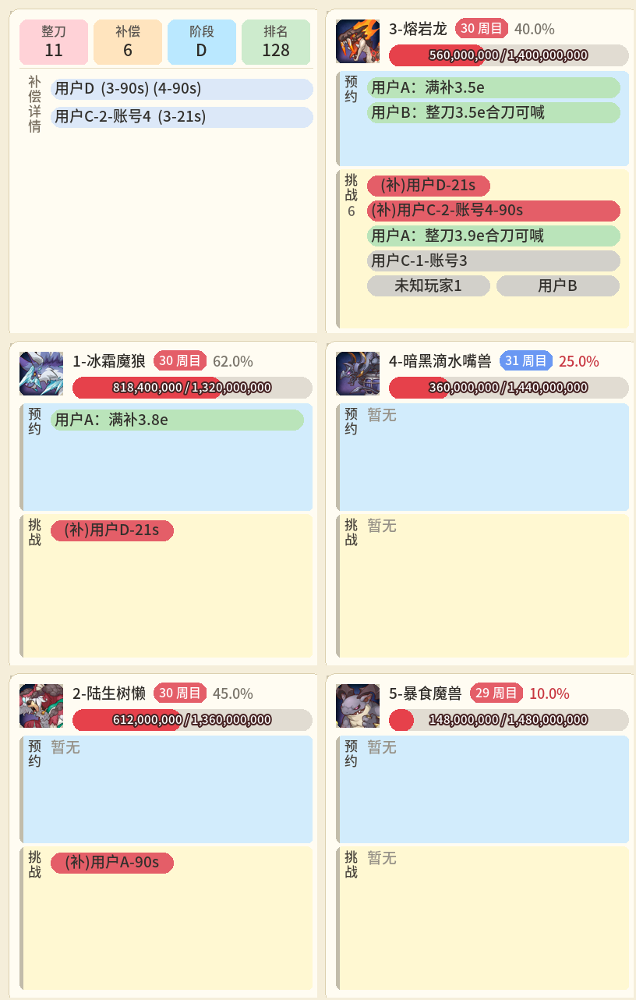
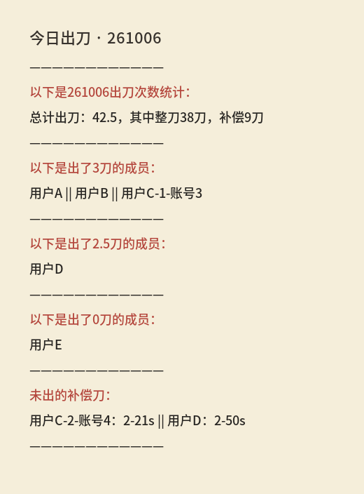
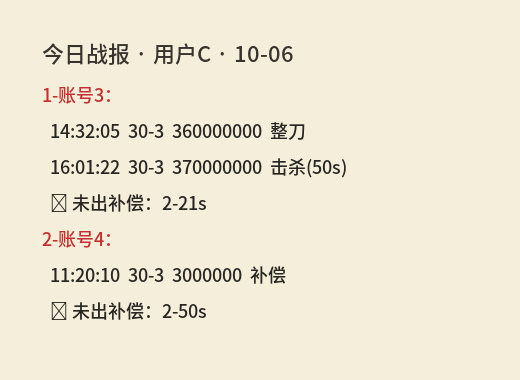
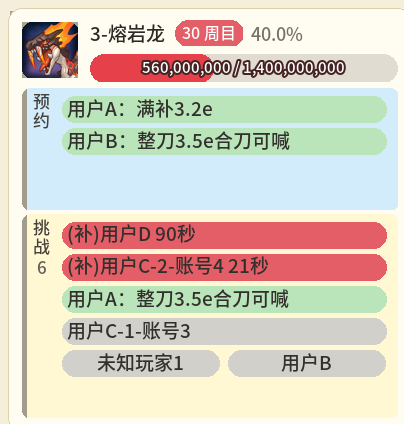
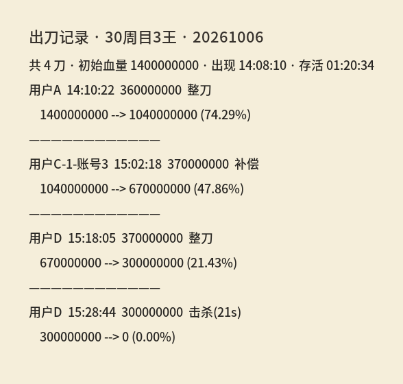

# KCR — 环奈连结 R（kanna_connection_redive）

**KCR** 是 [HoshinoBot](https://github.com/Ice9Coffee/HoshinoBot) 的公主连结会战插件：在群里自动推送出刀与击杀、维护挑战队列与预约、生成状态图与战报，并提供可选的 Web 会战面板。支持 **B 服 / 渠道服 / 台服**。

群内发送 **自动报刀帮助** 可查看完整指令列表；规格原文见 [`docs/developer/commands/会战指令.md`](docs/developer/commands/会战指令.md)。

---

## 项目亮点

### 1. 用「挑战人数 + 结算」还原 Boss 里有多少人在打

KCR 读取公会监控里 **Boss 挑战人数的上升沿** 与 **出刀结算记录**，维护 **`enter_signal`**（只靠上升沿增加，靠结算、群内 **sl / 掉刀** 减少，击杀清零）。在申请、进本提醒、报刀推送里展示「目前有 *n* 人正在挑战」及完整排队名单；*n* 与下方列表行数一致。若 *k* = `enter_signal` 且 *k* &lt; *n*，则显示「目前有 *n* 人正在挑战（Boss内 *k* 人）」。

- **推测本刀是整刀还是补偿**：结合该游戏账号 **今日剩余出刀点数**，在申请时提示「本刀为整刀 / 补偿刀」，在队列里为申请者打上 `(补偿)` 标记，并显示预留补偿秒数。
- **结算时同样推测刀型**，并在报刀首行说明；若 **击杀**，还会按游戏规则计算是否产生补偿秒数（合刀击杀、收尾击杀等与 **合刀 / cal** 计算器一致）。

### 2. 账号与用户绑定，方便喊补偿、催人出刀

成员在 **Web 会战面板**（或由管理员代绑）把 **QQ** 与 **游戏账号** 关联后，挑战队列与战报中会显示「谁在用哪个号、还剩几刀、准备打整刀还是多少秒的补偿」。其他人不用私聊追问，也能在群里看到例如 `(补偿)用户C-2-账号4-50s`，便于 **填补偿** 或 **催人出刀**。

### 3. 没申请就进本 →「未知玩家」

若有人在游戏里进了 Boss，但 **没有在群里申请出刀**，KCR 会在队列中增加 **未知玩家1**（多人时依次递增）。其他人一眼可知：**Boss 里已经有人在打，但不是队列里的已知申请**，减轻自闭玩家的影响。如果先进本再发申请出刀，KCR 会自动将未知玩家替换为刚申请的用户。

### 4. 申请、挑战播报、报刀结算三段信息一体化

优化了 **申请出刀成功**、**进本人数上升时的挑战播报**、**监控自动报刀** 三类回复：每条都带上 **该 Boss 当前周目、血量比例、挑战队列**（含留言、补偿、挂树、未知玩家）。成员 **不必频繁刷「状态」**，也能在相关 Boss 的对话上下文中快速掌握局面。

### 5. 挑战记录：按周目回放某一王的全部出刀

发送 **出刀记录**（如 `出刀记录3周目30`）可生成该 Boss 在指定周目内的 **出刀记录图**：按时间列出每刀伤害、刀型、结算前后血量与击杀补偿等，方便复盘合刀顺序与填坑责任，无需翻聊天记录。

### 6. 合刀线提醒：残血时 @ 仍在挑战的玩家

D 面起，当 Boss 剩余血量低于本会战的 **合刀线**（由近期整刀样本自动推算，管理可重算）时，监控报刀会在消息末尾 **@** 仍在挑战的已知申请者，并提示当前合刀线数值，便于残血阶段组织合刀（默认开启，可关）。详见 [`docs/design/合刀线提醒.md`](docs/design/合刀线提醒.md)。

此外提供 **状态 / 查1～5** 全图、**今日出刀 / 战报** 长图、**预约下一周目**、**Web 面板** 等能力；详见后文示例与 [`docs/`](docs/说明.md)。

---

## 效果示例（图片）

以下为开发工具生成的 **样例图**（版式示意，非真实公会数据）。

### 状态（`状态`）



### 今日出刀（`今日出刀`）



### 今日战报（`今日战报`）



### 查单个 Boss（`查3` 等）



### 出刀记录（`出刀记录3周目30` 等）



样例图可在本地执行 `python -m devtools.previews.readme_assets` 重新生成，见 [`devtools/README.md`](devtools/README.md)。

---

## 指令手册（摘录）

下列为群内 **完整回复文案** 示例（`@用户A` 表示 @ 发送指令的人），与 [`docs/developer/commands/会战指令.md`](docs/developer/commands/会战指令.md) **§3.9** 保持同步；更多分支与表格规格见同文档 §3.1–§3.6。

### 申请出刀 / 进

**格式**：`{进|申请出刀}<boss>[b][账号编号][:留言][@user]`  
`b` 表示按补偿刀申请；`账号编号` 为多绑时指定 账号1 / 账号2 / …

用户A 发送 `进三`（格式错误）：

```text
@用户A 指令格式错误
申请出刀格式：{进|申请出刀}<boss>[b][账号编号][:留言][@user]
例：进1 / 申请出刀1b / 申请出刀2 2 / 进3b：满补3.5e / 进3b 2@用户B
```

**申请成功 · 整刀、未 SL**（3 王 **30 周目**，剩余约 **5.6e / 14.0e**）。用户A 发送 `进3：整刀3.2e合刀可喊`：

```text
申请成功，当前3王状态：30周目 5.6e/14.0e，40%
申请人：
@用户A 今日剩余2.0刀未出，本刀为整刀
目前有4人正在挑战（Boss内1人）：
用户A：整刀3.2e合刀可喊
用户B
用户C-1-账号3
(补偿)用户D-50s
```

（上例：四人已申请，接口显示 Boss 内仅 1 人；*n*=4 与列表行数一致。）

**申请成功 · 补偿刀 `b`**。用户C 发送 `申请出刀3b：满补3.5e`：

```text
申请成功，当前3王状态：30周目 5.6e/14.0e，40%
申请人：
@用户C 今日剩余0.5刀未出，本刀为补偿刀，使用1-账号3
目前有5人正在挑战（Boss内1人）：
用户A：整刀3.2e合刀可喊
用户B
用户C-1-账号3
(补偿)用户C-2-账号4-21s
(补偿)用户D-50s
```

**申请成功 · 今日已 SL**（警告附在账号行后）。用户A 发送 `进3`：

```text
申请成功，当前3王状态：30周目 5.6e/14.0e，40%
申请人：
@用户A 今日剩余2.0刀未出，本刀为整刀：警告！您今日已使用SL，祝您好运
目前有4人正在挑战（Boss内1人）：
未知玩家1
用户B
(补偿)用户C-2-账号4-21s
(挂树)用户D
```

用户取消申请：用户A 发送 `取消申请`：

```text
已取消申请出刀记录 @用户A
```

用户A 发送 `取消申请5`（无申请）：

```text
未找到可取消的申请出刀记录 @用户A
```

用户A 今日出刀点数已用尽，发送 `进3`：

```text
@用户A 您今日已出完三刀，祝您拥有美好的一天
```

用户C 的 **编号1** 账号已在别的 Boss 申请中，发送 `进4 1`：

```text
@用户C 该账号已有进行中的申请，请先取消或使用其他账号
```

### 进本挑战播报（监控自动）

当游戏内 **3 王** 挑战人数上升时，群内可能推送：

```text
3王当前有1人出刀，申请队列中有4人：
用户A：整刀3.2e合刀可喊
用户B
用户C-1-账号3
(补偿)用户D-50s
```

### 报刀推送（监控自动）

**整刀、未击杀**（用户A · 账号1，伤害 **3.6e**；Boss 剩余约 **10.4e**）：

```text
用户A对30周目3王造成了360000000点伤害，今日剩余1.0刀未出，本刀为整刀。
当前3王状态：30周目 10.4e（1040000000/1400000000，74%）
目前有3人正在挑战（Boss内1人）：
用户B
(补偿)用户C-2-账号4-21s
(补偿)用户D-50s
```

**补偿刀、未击杀**（用户C · 编号1 / 账号3，伤害 **0.3e** 量级，示意补偿刀）：

```text
用户C-1-账号3对30周目3王造成了3000000点伤害，今日剩余0.0刀未出，本刀为补偿刀。
当前3王状态：30周目 1.9e（190000000/1400000000，14%）
目前有2人正在挑战：
用户A：整刀3.2e合刀可喊
用户B
```

**整刀击杀并产补偿**（用户D · 账号5，结算前剩余 **3.5e**，伤害 **3.5e**，获得 **21s**）：

```text
用户D对30周目3王造成了350000000点伤害，成功击杀并获得了21秒的补偿。今日剩余1.5刀未出，本刀为整刀。
当前3王状态：30周目 0.0e（0/1400000000，0%）
目前有0人正在挑战：
```

**补偿刀击杀收尾**（无秒数补偿；结算前剩余 **3.2e**）：

```text
用户C-2-账号4对31周目4王造成了320000000点伤害，成功击杀，未能获得补偿。今日剩余0.0刀未出，本刀为补偿刀。
当前4王状态：31周目 0.0e（0/1440000000，0%）
目前有0人正在挑战：
```

D 面且血量低于合刀线时，报刀可能增加合刀提醒前缀与末尾 `@` + `合刀线：x.xe` 两行，规则见 [`docs/design/合刀线提醒.md`](docs/design/合刀线提醒.md)。

### 预约

**格式**：`预约<boss>[周目N][:留言][@user]`  
须已开启 **出刀监控** 方可校验周目；省略周目时预约 **当前周目 + 1**。

用户A 发送 `预约一`（格式错误）：

```text
@用户A 指令格式错误
预约格式：预约<boss>[周目数][:留言][@user]
例：预约1 / 预约2周目31：满补3.5e / 预约3周目31：整刀3.2e合刀可喊@用户B
```

未开启出刀监控时，用户A 发送 `预约2`：

```text
@用户A 未开启出刀监控，无法校验预约周目，请先开启监控
```

场上 **1 王为 29 周目**，用户A 发送 `预约1周目30`（30 大于 29，合法）：

```text
成功预约30周目1王 @用户A
```

用户A 发送 `预约1周目20`（20 ≤ 29，不可预约过去或当前周目）：

```text
@用户A 无法预约该周目
1王当前为29周目，仅可预约30周目及之后
```

场上 3 王为 **30 周目**，用户A 发送 `预约3周目31：满补3.5e`：

```text
成功预约31周目3王 @用户A
预约留言：满补3.5e
```

用户A 再次发送完全相同预约：

```text
您已预约此boss，预约记录：31周目3王 @用户A
```

---

## Web 会战面板

KCR 提供浏览器端 **会战面板**（Vue SPA，构建产物在 `web/dist/`），与 QQ 群指令 **共用同一数据库**；在 Web 上的操作 **不会** 向 QQ 群发通知。会战面板主界面布局与交互参考了 [qwe3107231/kanna_connection_redive_2_web](https://github.com/qwe3107231/kanna_connection_redive_2_web)（KCR 2 时期的前端项目），在本仓库中与当前后端 API 对接并持续演进。

| 页面 | 谁能看 | 作用 |
|------|--------|------|
| **会战面板** | 已加入本公会 Web 的成员 | Boss 血量、挑战/预约队列、排名；管理员可删队列、开关监控 |
| **个人数据** | 同上 | 当期出刀、**自行绑定/排序游戏账号**（成员身份，非监控号） |
| **统计数据** | 同上 | 按日全员出刀表 |
| **管理运维** | KCR **管理员+** | 成员代绑、绑定视图、运维日志等 |

更细的页面说明见 [`docs/user/网页端.md`](docs/user/网页端.md)。

### 超级管理员如何配置

在部署机复制 `resource/data/setting_clanbattle.example.json` 为 `setting_clanbattle.json`。启动时 `ensure_config_or_exit()` 会校验；失败则 Bot **拒绝启动**并在终端列出问题项。以下按「要不要你动手改」分类，**不罗列 JSON 全部字段**。

**必须手动填写（首次部署）**

| 配置项 | 说明 |
|--------|------|
| `admin_qq` | 超级管理员 QQ（过码私聊、肃正、任命管理员） |
| `api.admin_key` | Admin OpenAPI 密钥（请求头 `X-Admin-Key`）。**不能**保留 `your-admin-key-here` 等占位符；代码**无**最小/最大长度限制，只要非空且非占位即可，建议自行生成足够长的随机字符串 |
| `web_admin.username` / `password` | Web 运维登录（与成员 QQ+密码 分离）；**不能**保留 `your-password-here` 等占位符 |

**多数情况下建议按环境调整**

| 配置项 | 何时改 |
|--------|--------|
| `web_panel.public_host` | 群聊「面板」链接的域名或公网 IP（默认 `127.0.0.1` 仅本机） |
| `api.host` / `port` / `base_path` | 与 Nginx 反代不一致时再改 |
| `captcha.lulu_token` / `ellye_token` | 监控号过码经常失败时再填 |
| `api.cookie_secure` / `cookie_httponly` | 生产 HTTPS 建议开启 `cookie_secure` |

**通常不必改（示例默认值即可）**

`monitor` 轮询间隔（默认 1 秒）、`monitor.max_concurrent_groups`、`captcha` 重试指令与等待时间、`yobot.enabled: false` 等，单机部署一般沿用示例即可。

**不在此 JSON 中维护**

出刀监控账号（最多 3 槽，私聊 `绑定账号1/2/3`）、委派管理员（≤5 人）、成员 QQ↔游戏 UID（Web 或管理运维）、当期 Boss 元数据、`admin_qqs`（旧版迁移项）等均在数据库或其它流程中维护。

### 如何登录

| 身份 | 方式 |
|------|------|
| **普通成员** | 私聊机器人 `注册` → 获得 QQ 号与初始密码 → 群聊/私聊 `面板` 或 `网页端登录` 打开浏览器 → **QQ 号 + 密码** 登录 |
| **管理员+ / 超管** | 同上（仍是成员 Cookie 登录）；若 `resolve_role` 判定为管理员+，侧栏出现 **管理运维** |
| **加入某公会数据** | 在目标群发送 `绑定本群公会`，或由管理员在 **管理运维** 配置；顶栏才能选该群 |

成员 **不需要** 私聊「绑定账号 密码」来完成 QQ↔游戏 UID 关联；应在 **个人数据** 从公会成员列表中选择自己的游戏角色绑定，或由管理员批量代绑。

### 超级管理员如何任命其他管理员

- **QQ 私聊bot**（仅 `admin_qq`）：`任命管理员 QQ号`、`撤销管理员 QQ号`、`管理员列表`（委派管理员 **最多 5 人**）
- **Web**：管理运维内任命/撤销（需登录超管账号，接口 `require_kcr_super`）

QQ **群主/群管** 若未被任命为 KCR 管理员，在 KCR 中与普通成员相同。

### QQ 指令：谁能执行什么

与 QQ 群管、Hoshino `SUPERUSERS` **无关**；详见 [`docs/developer/权限模型.md`](docs/developer/权限模型.md)。

| 范围 | 普通成员 | 管理员+（超管或委派） | 仅超级管理员 |
|------|:--------:|:-------------------:|:------------:|
| 状态、战报、预约、申请、合刀、查 Boss 等 | ✅ | ✅ | ✅ |
| 开启/关闭出刀监控、绑定 **监控** 账号（私聊） | ❌ | ✅ | ✅ |
| 清空预约/申请/未知申请、KPI 调整、修正出刀、刷新会战元数据（私聊） | ❌ | ✅ | ✅ |
| `启用肃正协议`（清空本群出刀数据） | ❌ | ❌ | ✅ |
| 任命/撤销管理员 | ❌ | ❌ | ✅ |

---

## 出刀监控

**出刀监控** 指机器人用 **监控账号** 登录游戏，轮询公会会战 API，驱动自动报刀、状态图、预约周目校验等。与成员的 **Web 游戏身份绑定** 是两套数据（`Account` 表 vs `user_account` 表）。

### 启用

1. **管理员+** 在机器人 **私聊** 完成监控账号绑定（见下节）。
2. 在目标 **群聊** 发送 `出刀监控` / `开启出刀监控`（默认使用 **槽位 1**），或 `出刀监控2` / `出刀监控3` 指定槽位。
3. 发送 `状态` 或 `出刀监控状态` 确认已在跑。

未绑定监控账号时，群聊会提示先私聊 `绑定账号帮助` 并按说明配置。

### 绑定监控账号（私聊，管理员+）

这是 **唯一** 需要向机器人提供游戏账号密码（或渠道/台服等价凭证）的场景，仅用于 **登录监控号**。

| 槽位 | B 服示例（私聊） |
|------|------------------|
| 1 | `绑定账号1 账号 密码` |
| 2 | `绑定账号2 账号 密码` |
| 3 | `绑定账号3 账号 密码` |

渠道服：`渠绑定账号 login_id token`；台服：`台绑定账号 short_udid udid viewer_id`。过码失败可按帮助中的 `重试过码` 等指令处理。

**最多 3 个监控槽位**（1～3），对应最多预绑 3 个游戏账号；群内通过 `出刀监控` / `出刀监控2` / `出刀监控3` 选择用哪一号登录轮询。

### 查看状态与切换账号

| 指令 | 权限 | 说明 |
|------|------|------|
| `出刀监控状态` | 全员 | 本群是否监控中、当前槽位、账号名等 |
| `出刀监控` / `出刀监控1` | 管理员+ | 用槽位 1 登录并开启（已开启则幂等提示） |
| `出刀监控2` / `出刀监控3` | 管理员+ | 切换到对应槽位：**先**登录目标号，成功后再切换；失败则保持原槽位 |
| `取消出刀监控` | 管理员+ | 停止本群监控 |

Web **会战面板** 上管理员也可开关监控，逻辑与 QQ 一致，不向群内发消息。

更完整的响应文案见 [`docs/user/自动报刀.md`](docs/user/自动报刀.md) 与 [`docs/user/账号绑定.md`](docs/user/账号绑定.md)。

---

## 安装与部署（简要）

1. 将本仓库克隆到 `HoshinoBot/hoshino/modules/kanna_connection_redive`（目录名须一致）。  
2. 在 `hoshino/config/__bot__.py` 的 `MODULES_ON` 中加入 `'kanna_connection_redive'`。  
3. 复制 `setting_clanbattle.example.json` 为 `setting_clanbattle.json` 并填写（**勿提交 Git**；填写要点见上文 **超级管理员如何配置**）。  
4. 启动协议端与 Hoshino；按上文 **出刀监控** 绑定监控号并群内 `出刀监控`；成员 `注册` 后使用 Web 绑定游戏身份。

```bash
git clone https://github.com/KagamiR142/kanna_connection_redive.git kanna_connection_redive
```

详细步骤、Web 前端构建与 Nginx：[`docs/deploy/安装指南.md`](docs/deploy/安装指南.md)。监控私聊绑定与过码工具：[pcr_login_helper](https://github.com/SonderXiaoming/pcr_login_helper)。

---

## 文档与开发

| 目录 | 内容 |
|------|------|
| [`docs/user/`](docs/user/) | 成员上手与 Web |
| [`docs/developer/`](docs/developer/) | 指令规格、权限、API |
| [`docs/design/`](docs/design/) | 队列、合刀线、刀型规则 |
| [`docs/deploy/`](docs/deploy/) | 运维与覆盖部署 |

本地检查：`pip install pytest ruff` 后执行 `python scripts/run_checks.py`。贡献见 [`CONTRIBUTING.md`](CONTRIBUTING.md)。

开源前请勿上传 `setting_clanbattle.json`、过码密钥与 `data/` 下群库，见 [`docs/developer/安全检查清单.md`](docs/developer/安全检查清单.md)。

---

## 许可证与声明

[MIT](LICENSE)

本插件为第三方工具，与 Cygames / 国服运营商无关。使用游戏 API 与账号绑定需自行承担风险；公会是否允许自动化工具由公会自行约定。
